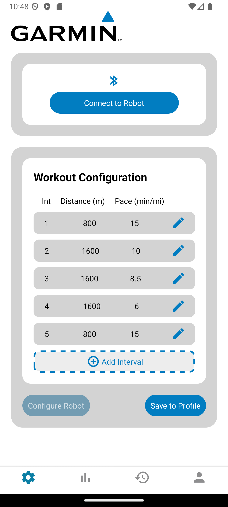
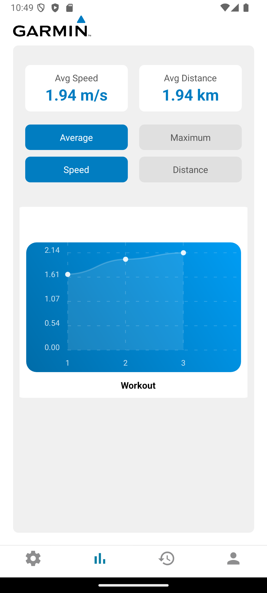
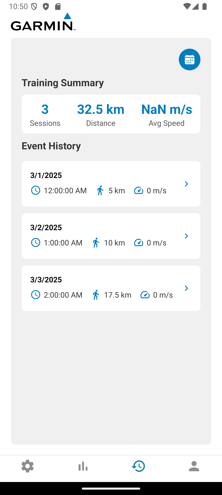
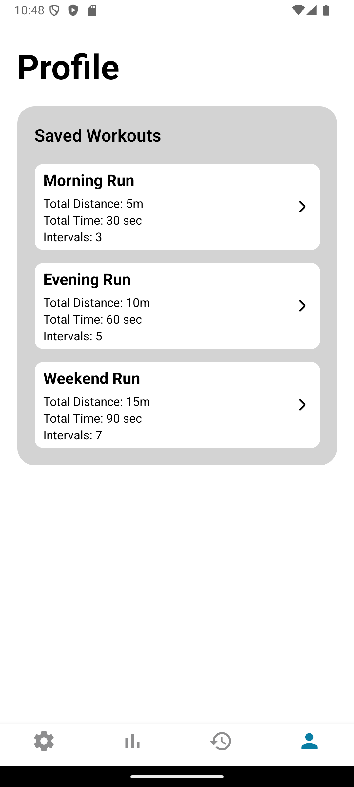

## Mobile App
React Native mobile application for [RoboRacer](https://github.com/stevesarb/RoboRacer) that provides an interface to configure the robot. 

### Setup Instructions
1. Clone this repo: `git clone https://github.com/doehrins/robo-racer-mobile-app.git`
2. Install dependencies `npm install`
3. Build app to emulator: `npx expo run:android`
  a. **NOTE**: this is oversimplified, much more documentation is needed here

### Deployment Procedures
??

### Maintenance Guidelines
??

### Troubleshooting
- **Emulator Build Failing**
  - Check environment variables: `ANDROID_HOME, JAVA_HOME`
  - Follow this tutorial: __**link to tutorial**__